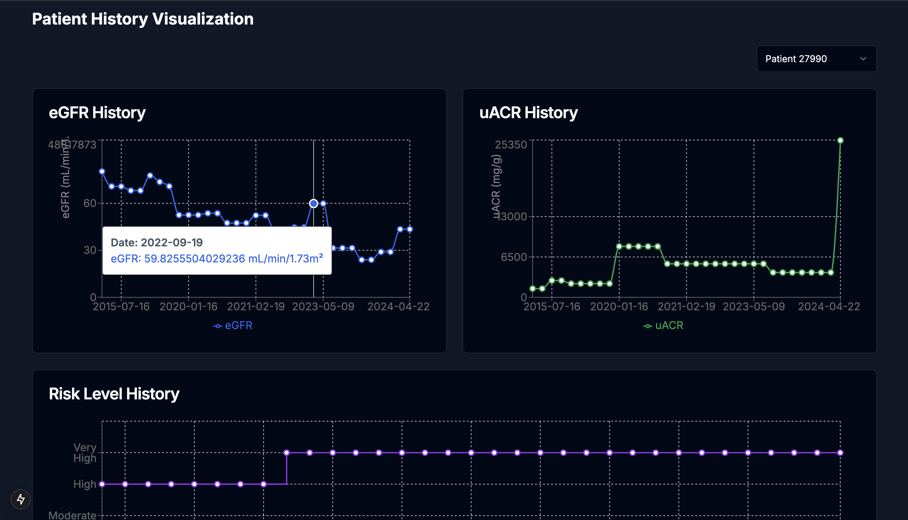

# Automated CKD Stratification

A comprehensive system for early detection, risk stratification, and management of Chronic Kidney Disease (CKD).



## Project Overview

The Automated CKD Stratification system is designed to assist healthcare providers in the early detection and management of Chronic Kidney Disease. CKD is a significant global health issue that often goes undetected until advanced stages. Early identification and proper management can significantly slow disease progression and improve patient outcomes.

This application combines machine learning models, clinical guidelines, and an intuitive user interface to:

- Predict CKD risk based on laboratory test results
- Stratify patients according to risk levels
- Generate clinical alerts for high-risk patients
- Provide evidence-based recommendations from KDIGO guidelines
- Create automated referrals and test orders

## Project Structure

### Backend Components

- **FastAPI Server**: Provides API endpoints for predictions and text generation
- **Machine Learning Models**: Trained models for CKD risk prediction
- **RAG System**: Retrieval-Augmented Generation system that provides clinical advice based on KDIGO guidelines
- **Data Processing**: ETL pipelines for processing patient data

### Frontend Components

- **Alert Dashboard**: Monitors and manages patient alerts
- **Risk Assessment**: Visualizes patient history and risk levels
- **CKD Prediction**: Provides ML-based prediction of CKD risk
- **PDF Generator**: Creates clinical documents like referrals and test orders

## Features and Functionality

### Alert Dashboard

The Alert Dashboard provides a centralized view of all patient alerts, categorized by priority (Critical, High, Medium, Low) and type (Risk, Test, Prediction, Medication, Referral). Healthcare providers can:

- Filter alerts by priority, category, or search terms
- View active and acknowledged alerts
- Access detailed information for each alert
- Acknowledge alerts after taking appropriate action

### Risk Assessment

The Risk Assessment module visualizes patient kidney function over time, including:

- eGFR (estimated Glomerular Filtration Rate) history
- uACR (urine Albumin-to-Creatinine Ratio) history
- Risk level classification based on KDIGO guidelines
- Interactive charts for trend analysis

### CKD Prediction

The CKD Prediction module uses machine learning models to predict the risk of CKD development or progression based on laboratory test results:

- Patient selection and test data visualization
- Risk probability calculation
- Risk level classification (Low, Moderate, High)
- Assessment details for clinical decision-making

### PDF Generation

The system can automatically generate clinical documents:

- Nephrology referrals for high-risk patients
- Laboratory test orders for recommended tests
- Standardized formats for clinical workflow integration

### RAG-based Clinical Advice

The system leverages a language model with Retrieval-Augmented Generation to provide evidence-based clinical advice:

- Contextually relevant information from KDIGO guidelines
- Personalized recommendations based on patient data
- Citations to clinical guidelines for reference

## Getting Started

### Prerequisites

- [Docker](https://docs.docker.com/get-docker/)
- [Docker Compose](https://docs.docker.com/compose/install/) (usually included with Docker Desktop)

### Required Files

Before running the application, make sure you have the following files:

1. **Model File**: Place your GGUF model file in the project root and rename it to `model.gguf`
2. **Data Files**:
   - Place any CSV data files in the `data` directory
   - For the frontend, ensure you have `cleaned_data.csv` and `cleaned_labs.csv` in the `my-app/public/data` directory

### Installation and Setup

1. Clone the repository:
   ```bash
   git clone https://github.com/yourusername/automated-ckd-stratification.git
   cd automated-ckd-stratification
   ```

2. Run the setup script:
   ```bash
   ./docker-setup.sh
   ```

3. Build and start the application:
   ```bash
   docker-compose up -d
   ```

4. Access the application:
   - Frontend: http://localhost:3000
   - Backend API: http://localhost:8000

### Running Without Docker

#### Backend Setup

1. Install Python dependencies:
   ```bash
   pip install -e .
   pip install llama-cpp-python langchain langchain_huggingface langchain_community scikit-learn fastapi uvicorn
   ```

2. Start the backend server:
   ```bash
   python api_back.py
   ```

#### Frontend Setup

1. Navigate to the frontend directory:
   ```bash
   cd my-app
   ```

2. Install Node.js dependencies:
   ```bash
   npm install
   ```

3. Start the development server:
   ```bash
   npm run dev
   ```

## Technical Details

### Technologies Used

- **Backend**:
  - Python 3.11
  - FastAPI
  - Llama CPP (for language model inference)
  - Scikit-learn (for machine learning models)
  - Langchain (for RAG implementation)

- **Frontend**:
  - Next.js
  - TypeScript
  - Tailwind CSS
  - Recharts (for data visualization)
  - jsPDF (for PDF generation)

### API Endpoints

- `/predict`: Endpoint for model predictions
- `/generate`: Endpoint for simple text generation
- `/generate_rag`: Endpoint for text generation with RAG context

### Data Requirements

The application requires the following data files:

- `cleaned_data.csv`: Contains patient eGFR, uACR, and risk level data
- `cleaned_labs.csv`: Contains laboratory test results

## License

This project is licensed under the terms of the license included in the repository.
